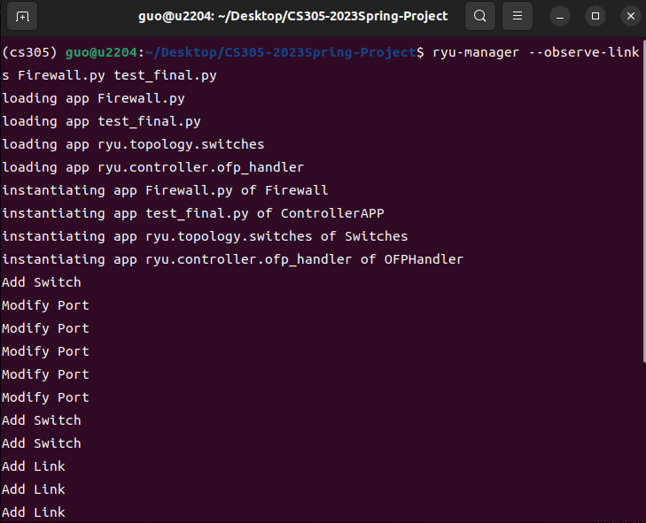

## SUSTech_CS305-Network_2023s_Project-Ryu

#### Teammates：徐春晖，郭健阳，彭子燊

> The source code is hosted on GitHub and will be open-sourced based on **MIT License** after the project deadline. The access link is:
>
> https://github.com/OctCarp/SUSTech_CS305-Network_2023s_Project-Ryu

------

### Developers

| Name       | SID          | Responsible for     | Rate |
| ---------- | ------------ | ------------------- | ---- |
| **徐春晖** | **12110304** | DHCP, Shortest path | 1/3  |
| **郭健阳** | **12111506** | Firewall, DNS       | 1/3  |
| **彭子燊** | **12110323** | Shortest path       | 1/3  |

### Project Instruction

This project requires the use of **Mininet** for network topology simulation and **Ryu Controller** as the controller to implement a simple SDN simulation. DHCP and shortest path routing functions are required.

### Function Display

### DHCP 

This software implements a simple DHCP server, allocates IP addresses to broadcast hosts from a given IP pool, and avoids duplication.  A simple lease information feature is implemented as well.

#### Utils

First, we use two function to implement conversion between IP address string and 32-bit numbers

```python
def ip_to_int(ip_address):
    ip = ip_address.split('.')
    return (int(ip[0]) << 24) + (int(ip[1]) << 16) + (int(ip[2]) << 8) + int(ip[3])


def int_to_ip(num):
    return f"{num >> 24}.{(num >> 16) & 0xff}.{(num >> 8) & 0xff}.{num & 0xff}"
```

Thus, we can convert IP address strings like `'x.x.x.x'` to a 32 bit number and vice versa.

#### Static Info and fuction

Then, we set some informations for DHCP server:

```python
class DHCPServer():
    #  class variables
    hardware_addr = Config.controller_macAddr
    server_ip = Config.server_ip
    dns = Config.dns
    start_ip = Config.start_ip
    end_ip = Config.end_ip
    start_ip_i = ip_to_int(start_ip)  # 32 bits number for start IP
    end_ip_i = ip_to_int(end_ip)  # 32 bits number for start IP
    netmask = Config.netmask
    lease_time = Config.lease_time  # default lease time

    ip_mac = {}  # Map between IP and host MAC
    for i in range(start_ip_i, end_ip_i + 1):  # initialization
        ip_mac[i] = 'ok'  # If it is 'OK', meanings the IP is available

    # do some initialization for byte type data below
    server_ip_byte = addrconv.ipv4.text_to_bin(server_ip)
    netmask_byte = addrconv.ipv4.text_to_bin(netmask)
    dns_byte = addrconv.ipv4.text_to_bin(dns)
    lease_time_byte = struct.pack('>I', lease_time)

    offer_byte = struct.pack('>B', dhcp.DHCP_OFFER)
    ack_byte = struct.pack('>B', dhcp.DHCP_ACK)
```

We use this function below to check whether a new IP for new client is OK, or it is already exist a mapping. Then we return a IP address available, or `'0.0.0.0'` for not available.

```python
@classmethod
def check_ip_mac(cls, req_ip_i, client_mac):
    ip_return = '0.0.0.0'
    if (not req_ip_i == 0) and (cls.ip_mac[req_ip_i] == client_mac or cls.ip_mac[req_ip_i] == 'ok'):
        # if it has required IP and it is available
        for ip_i in cls.ip_mac:
            if cls.ip_mac[ip_i] == client_mac:
                cls.ip_mac[ip_i] = 'ok'  # clear the previous IP info for this client
        cls.ip_mac[req_ip_i] = client_mac
        ip_return = int_to_ip(req_ip_i)  # return the IP string
    else:
        has_mac = False
        for ip_i in cls.ip_mac:
            if cls.ip_mac[ip_i] == client_mac:
                ip_return = int_to_ip(ip_i)  # has previous IP information for the client
                has_mac = True
                break
        if not has_mac:
            for ip_i in cls.ip_mac:
                if cls.ip_mac[ip_i] == 'ok':  # has available IP for new MAC
                    cls.ip_mac[ip_i] = client_mac
                    ip_return = int_to_ip(ip_i)
                    break
    return ip_return  # return IP string in the end
```

#### Generate Offer and ACK packet

Then we handle the DHCP Offer Packet after DHCP Discover. The following code shows the details.

```python
@classmethod
def assemble_offer(cls, pkt):
    # get each layer for the packet
    c_eth = pkt.get_protocol(ethernet.ethernet)
    c_ipv4 = pkt.get_protocol(ipv4.ipv4)
    c_udp = pkt.get_protocol(udp.udp)
    c_dhcp = pkt.get_protocol(dhcp.dhcp)

    client_mac = c_eth.src  # get client MAC for IP-MAC mapping

    offer_pkt = packet.Packet()
    offer_pkt.add_protocol(ethernet.ethernet(
        ethertype=c_eth.ethertype,  # sync
        dst=client_mac,  # client mac
        src=cls.hardware_addr  # controller mac
    ))

    offer_pkt.add_protocol(ipv4.ipv4(
        version=c_ipv4.version,  # sync
        proto=c_ipv4.proto,  # sync
        src=cls.server_ip,  # dhcp server ip
        dst='255.255.255.255'  # broadcast addr
    ))

    offer_pkt.add_protocol(udp.udp(
        src_port=c_udp.dst_port,  # port 67
        dst_port=c_udp.src_port  # port 68
    ))

    req_ip_i = 0

    for opt in c_dhcp.options.option_list:
        if opt.tag == dhcp.DHCP_REQUESTED_IP_ADDR_OPT:  # if it has required IP address
            req_ip_i = int.from_bytes(opt.value, byteorder='big')  # unpack IP information

    offer_return_ip = cls.check_ip_mac(req_ip_i, client_mac)  # get IP for client

    offer_pkt.add_protocol(dhcp.dhcp(
        op=dhcp.DHCP_BOOT_REPLY,  # 2
        htype=1,  # ethernet
        hlen=c_dhcp.hlen,
        xid=c_dhcp.xid,  # random transaction id, define by client
        flags=0,  # unicast
        ciaddr='0.0.0.0',
        yiaddr=offer_return_ip,  # Your (client) IP address
        siaddr=cls.server_ip,  # Server IP address
        chaddr=c_dhcp.chaddr,  # Client hardware address (MAC addr)
        options=dhcp.options([
            dhcp.option(tag=dhcp.DHCP_MESSAGE_TYPE_OPT,  # set message type as offer
                        value=cls.offer_byte  # byte for number 2
                        ),
            dhcp.option(tag=dhcp.DHCP_IP_ADDR_LEASE_TIME_OPT,
                        value=cls.lease_time_byte  # add lease time info
                        ),
            dhcp.option(tag=dhcp.DHCP_SERVER_IDENTIFIER_OPT,
                        value=cls.server_ip_byte  # add server identifier
                        ),
            dhcp.option(tag=dhcp.DHCP_SUBNET_MASK_OPT,
                        value=cls.netmask_byte  # add subnet info
                        ),
            dhcp.option(tag=dhcp.DHCP_DNS_SERVER_ADDR_OPT,
                        value=cls.dns_byte  # add DNS info
                        )
        ])
    ))

    return offer_pkt  # return the packet finally
```

Because we handle the `DHCP_REQUESTED_IP_ADDR_OPT`, so the implementation of DHCP ACK is very similar to DHCP Offer, we just need to change `DHCP_MESSAGE_TYPE_OPT` to `5` in byte, which means this packet is a DHCP ACK. For brevity, we will not show the code this time.

### DHCP Test

#### Basic 1

We use wireshark with GUI  to capture the DHCP packets.

For basic test, we have two host, need 8 packets in total to complete IP allocation twice.


Packet 2 in detail, this is a valid DHCP offer package:


Packet 4 in detail, this is a valid DHCP ACK package, including the lease time information:


And it is the same for client 2.

#### Lease Time

And we implement DHCP lease time. About 70 s. The error is about TCP caputure, it doesn't matter,


By the time is reached, the client will send a renewal DHCP Request packet, and the server will renew and give feedback with the correct IP, like packet 9 and 10: 


If the lease end time has already passed, the client will send a DHCP Discover with request IP, and the server will renew and give feedback with the correct IP as well, like packet 11 and 12: 


#### Basic 2

We created 6 DHCP clients, but only assigned the start and end IP of `192.168.1.11` - `192.168.1.14` for the IP pool, which means two client will not have a available IP.


Packet 16, the ACK for the fourth client, is available.


But the fifth and sixth client will not have available IP, just `0.0.0.0`, because the IP pool has already full.

Replying the Offer packet is only for the display and endding the test, but in fact this IP is invalid.


In the above display, because of the mapping between IP and MAC, no duplicate IP will be allocated.

This is a brief demonstration of the DHCP function.

#### No Duplicate IP Allocation

By using the IP-MAC dic pool, we can guarantee each IP will only have one corresponding MAC, and there will be no duplication

## Shortest path switching

### Code

- function `update_topo`, update the topology structure each time wo do modification operations.

```python
def update_topo(self):
    self.clear()  # init table
    self.swids = [sw.dp.id for sw in get_all_switch(self)]  #get all dpid

    links_list = get_all_link(self)
    for link in links_list:  #get all link
        self.adj[link.src.dpid][link.dst.dpid] = link.src.port_no
        self.adj[link.dst.dpid][link.src.dpid] = link.dst.port_no

    for cur_switch in self.swids:  # for each switch
        for host_mac in self.host_port.keys():  # then for each host mac
            host_swid = self.host_port[host_mac][0]
            host_port_no = self.host_port[host_mac][1]
            sw_port = self.shortest(cur_switch, host_swid, host_port_no)  # find sp
            if sw_port:  # has path
                for sw_id, out_port in sw_port:
                    dp = get_switch(self, sw_id)[0].dp
                    match = dp.ofproto_parser.OFPMatch(dl_dst=host_mac)
                    actions = [dp.ofproto_parser.OFPActionOutput(out_port)]
                    mod = dp.ofproto_parser.OFPFlowMod(datapath=dp, match=match,
                                                       priority=1, actions=actions)
                    dp.send_msg(mod)  # send flow table

            for src_mac in self.host_port.keys():
                if self.host_port[src_mac][0] == cur_switch:  # src host
                    src_port = self.host_port[src_mac]
                    if sw_port and self.port_state[(src_port[0], src_port[1])]:
                        self.print_path(sw_port=sw_port, src_mac=src_mac, dst_mac=host_mac)
                    elif src_mac != host_mac:
                        print(f"Net is break for {src_mac} to {host_mac}")
```

- function `shortest`, get shortest path according to the given src and dst, containing the `switch id` and the `port` it send packet out of each switch in the shortest path. We use simple BFS, and get each switch and its output port.

```python
def shortest(self, src_sw, dst_sw, dst_port):
    if not self.port_state[(dst_sw, dst_port)]:
        return None  # host port shut down, None

    if src_sw == dst_sw: # dst switch to host
        return [(dst_sw, dst_port)]

    dis = {}  # distance
    fa = {}  # father node

    nodes = self.swids
    for node in nodes:
        dis[node] = float('inf')  # init
        fa[node] = None

    que = Queue()
    que.put(src_sw)
    dis[src_sw] = 0
    while not que.empty():
        cur = que.get()  # BFS
        for sw in nodes:
            if self.adj[cur][sw] is not None and dis[sw] > dis[cur] + 1:
                dis[sw] = dis[cur] + 1
                fa[sw] = cur
                que.put(sw)

    path_ids = []
    if dst_sw not in fa.keys():
        return None  # can not reach host

    father = fa[dst_sw]
    cur = dst_sw
    while True:  # find the father node
        if cur == src_sw:
            path_ids.append(src_sw)
            break
        elif father is None:
            return None
        else:
            path_ids.append(cur)
            father = fa[cur]
            cur = father
    path_ids.reverse()  # we get the switch ID in this path
```


### Test

#### basic test case

##### 1.initial topology structure


##### 2.the shortest path between any two hosts and length between any two switches


##### 3.use `pingall` to verify connectivity between all hosts


#### complex test case

You can check [switching_test/test_network.py](../tests/switching_test/test_network.py) `class ComplexTopo` for original information.

##### 1.initial topology structure


##### 2.the shortest path between any two hosts and length between any two switches

- Overall

  

- Add Host（Initial）

  

- Delete Switch

  before delete switch s8：

  

  after delete switch s8：

  

- Add Switch

  before add switch s1：

  

  after add switch s1：

  

- Delete Link

  before delete link s3->s7：

  

  after delete link s3->s7：

  

- Add Link

  before add link s5->s8：

  

  after add link s5->s8：

  

- Modify Port

  before disable port 3 in switch 3（to switch 8）：

  

  after disable port 3 in switch 3：

  

  after enable port 3 in switch 3 again：

  

##### 3.use `pingall` to verify connectivity between all hosts


## Bonus 

### Firewall

### Code

- We block packet to host which mac address is  `00:00:00:00:00:01` 
- This is our new firewall code.

```python
from ryu.controller.handler import set_ev_cls
from ryu.ofproto import ofproto_v1_0, ofproto_v1_0_parser
from ryu.topology.api import *


class Firewall(app_manager.RyuApp):
    OFP_VERSIONS = [ofproto_v1_0.OFP_VERSION]

    def __init__(self, *args, **kwargs):
        super(Firewall, self).__init__(*args, **kwargs)
        self.target = []
        self.target.append('00:00:00:00:00:01')

    @set_ev_cls(event.EventSwitchEnter)
    def switch_features_handler(self, ev):
        for drop_mac in self.target:
            match = ofproto_v1_0_parser.OFPMatch(dl_dst=drop_mac)
            command = ofproto_v1_0.OFPFC_ADD
            drop = ofproto_v1_0.OFPP_NONE
            actions = None
            req = ofproto_v1_0_parser.OFPFlowMod(datapath=ev.switch.dp, command=command, idle_timeout=0, 												     hard_timeout=0,priority=600, match=match, actions=actions)
            ev.switch.dp.send_msg(req)

```

### Test

- Using `ryu-manager --observe-links` to run `firewall.py` and `test_final.py` .



- Run `test_network.py` which also use to check shortest path to build network topology.


- h1'packet was blocked by firewall. Because h1's mac address is  `00:00:00:00:00:01` .


- h2 and h3 can send packet to each other.


- This our original firewall code. But we find `EventOFPSwitchFeatures` in `@set_ev_cls(ofp_event.EventOFPSwitchFeatures, CONFIG_DISPATCHER)` and `EventOFPPacketIn`  in  ` @set_ev_cls(ofp_event.EventOFPPacketIn, MAIN_DISPATCHER)` are not exist. So we rewrite our firewall code.

```python
from ryu.base import app_manager
from ryu.controller.handler import CONFIG_DISPATCHER, MAIN_DISPATCHER, set_ev_cls
from ryu.controller import ofp_event
from ryu.ofproto import ofproto_v1_3
from ryu.lib.packet import packet
from ryu.lib.packet import ethernet


class FirewallApp(app_manager. RyuApp):
     OFP_VERSIONS = [ofproto_v1_3.OFP_VERSION]

     def __init__(self, *args, **kwargs):
         super(FirewallApp, self).__init__(*args, **kwargs)
         self.mac_to_port = {}

     @set_ev_cls(ofp_event.EventOFPSwitchFeatures, CONFIG_DISPATCHER)
     def switch_features_handler(self, ev):
         datapath = ev.msg.datapath
         ofproto = datapath.ofproto
         parser = datapath.ofproto_parser

         # Add default flow table rules to forward all packets to the controller for processing
         match = parser.OFPMatch()
         actions = [parser.OFPActionOutput(ofproto.OFPP_CONTROLLER,
                                           ofproto.OFPCML_NO_BUFFER)]
         self. add_flow(datapath, 0, match, actions)

     def add_flow(self, datapath, priority, match, actions):
         ofproto = datapath.ofproto
         parser = datapath.ofproto_parser

         # Create flow table rules
         inst = [parser.OFPInstructionActions(ofproto.OFPIT_APPLY_ACTIONS,
                                              actions)]
         mod = parser.OFPFlowMod(datapath=datapath, priority=priority,
                                 match=match, instructions=inst)
         datapath. send_msg(mod)

     @set_ev_cls(ofp_event.EventOFPPacketIn, MAIN_DISPATCHER)
     def packet_in_handler(self, ev):
         # Parse the received packet
         msg = ev.msg
         datapath = msg.datapath
         ofproto = datapath.ofproto
         parser = datapath.ofproto_parser
         in_port = msg.match['in_port']

         pkt = packet.Packet(msg.data)
         eth_pkt = pkt.get_protocol(ethernet.ethernet)

         # ignore non-Ethernet packets
         if not eth_pkt:
             return

         # Get the source MAC address and destination MAC address
         src_mac = eth_pkt.src
         dst_mac = eth_pkt.dst

         # Record the mapping relationship between source MAC address and port in the mac_to_port dictionary
         if datapath.id not in self.mac_to_port:
             self.mac_to_port[datapath.id] = {}
         self.mac_to_port[datapath.id][src_mac] = in_port

         # Check firewall rules and decide whether to block packets
         if self.firewall_check(src_mac, dst_mac):
             # block packets
             return

         # Find the port based on the destination MAC address and send the packet
         if dst_mac in self.mac_to_port[datapath.id]:
             out_port = self.mac_to_port[datapath.id][dst_mac]
         else:
             # If the destination MAC address is unknown, send packets to all ports (broadcast)
             out_port = ofproto.OFPP_FLOOD

         # Create a flow table rule to forward the packet to the corresponding port
         actions = [parser. OFPActionOutput(out_port)]
         data = None
         if msg.buffer_id == ofproto.OFP_NO_BUFFER:
             data = msg.data
         out = parser.OFPPacketOut(datapath=datapath, buffer_id=msg.buffer_id,
                                   in_port=in_port, actions=actions, data=data)
         datapath. send_msg(out)

     def firewall_check(self, src_mac, dst_mac):
        

         # Example rule: Block packets with source MAC address 00:00:00:00:00:01
         if src_mac == '00:00:00:00:00:01':
             return True

         return False
```

#### DNS

Originally implemented an independent DNS server, but later found that it was necessary to implement DNS based on Ryu, but due to time constraints, it was not completed.

Implementation idea: The implementation idea of this function is similar to that of a DHCP server. It is necessary to first use `getProtocol()` identify whether there is a DNS protocol packet in the application layer, and then reply the corresponding DNS data packet according to the protocol content.

We can use tuples to store static DNS information in DNS Server for DNS response, such as `('www.google.com', '162.125.6.1', 'A')`, if we match the correct records in DNS, we can use a new packet to host to give response.

This is our DNS code originally.

```python
from dnslib import *
from dnslib.server import DNSServer, DNSHandler, BaseResolver


class MyHandler(DNSHandler):

    def __init__(self, request, client_address, server):
        super().__init__(request, client_address, server)

    def handle(self):
        # 'handle DNS logic'
        data = self.request[0]  # get request data

        # resolve DNS requests
        request = DNSRecord.parse(data)

        qname = request.q.qname
        qtype = request.q.qtype

        # print DNS info
        print(f"Received DNS query for {qname} ({QTYPE[qtype]}) from {self.client_address[0]}")

        # manage DNS response
        reply = request.reply()

        # reply = request.reply()

        if qtype == QTYPE.A:
            # handle type A request
            # insert DNS A query logic
            reply.add_answer(RR(qname, qtype, rdata=A("127.0.0.1")))
        elif qtype == QTYPE.AAAA:
            # handle type AAAA request
            # insert DNS AAAA query logic
            reply.add_answer(RR(qname, qtype, rdata=AAAA("::1")))
        elif qtype == QTYPE.NS:
            # handle NS request
            # insert NS query logic
            reply.add_answer(RR(qname, qtype, rdata=A("ns.example.com")))
            pass
        elif qtype == QTYPE.CNAME:
            # handle CNAME request
            # insert CNAME query logic
            reply.add_answer(RR(qname, qtype, rdata=A("cname.example.com")))
            pass
        elif qtype == QTYPE.MX:
            # handle MX request
            # handle MX query logic
            reply.add_answer(RR(qname, qtype, rdata=A("mail.example.com")))
            pass
        else:
            # for unsupported query types, return an error response
            reply.header.rcode = RCODE.NXDOMAIN
        # send DNS response to client
        self.send_response(reply)

    def send_response(self, reply):
        # send DNS response to client
        self.server.socket.sendto(reply.pack(), self.client_address)


MyDNSserver = DNSServer(resolver=BaseResolver, handler=MyHandler, port=53, address="0.0.0.0")


if __name__ == '__main__':

    try:
        print("Starting DNS server...")
        print("Starting DNS server successfully.")
        MyDNSserver.start()
        while True:
            pass
    except KeyboardInterrupt:
        pass
    finally:
        print("Closing DNS server...")
        MyDNSserver.stop()
        print("Closing DNS server successfully.")
```

This is our new code. But we have not finish DNS controller part. In our new DNS Server version we try to complete DNS Server with Ryu. We get packet from DNS controller and handle packet data. Then generate reply packet and send to DNS controller. This DNS Server uses static response but we can also use dynamic response by creating a RRs list to save some RRs. Then if matched `qname`  and `qtype` we can send `RR` in `RRs` list back.

```python
from ryu.lib import addrconv
from ryu.lib.packet import packet
from ryu.lib.packet import ethernet
from ryu.lib.packet import ipv4
from dnslib import DNSRecord, RR, QTYPE, A, CNAME
from dnslib import *
from dnslib.server import DNSServer, DNSHandler, BaseResolver


class DNS_Server():

    def reply_packet(self, request):

        r = request.reply()

        if not request.querys:
            print("ERROR: Blank request.")
            return r

        for query in request.querys:
            name = query.get_qname
            type = query.qtype
            print(f"Received DNS query for {name} ({QTYPE[type]}) from {query.client_address[0]}")

            if type == QTYPE.A:
                # Handle A record query
                # Add your A record query logic here
                r.add_answer(RR(name, type, rdata=A("127.0.0.1")))
            elif type == QTYPE.AAAA:
                # Handle AAAA record query
                # Add your AAAA record query logic here
                r.add_answer(RR(name, type, rdata=AAAA("::1")))
            elif type == QTYPE.NS:
                # Handle NS record query
                # Add your NS record query logic here
                r.add_answer(RR(name, type, rdata=A("ns.example.com")))
                pass
            elif type == QTYPE.CNAME:
                # Handle CNAME record lookups
                # Add your CNAME record query logic here
                r.add_answer(RR(name, type, rdata=A("cname.example.com")))
                pass
            elif type == QTYPE.MX:
                # Handle MX record lookups
                # Add your MX record query logic here
                r.add_answer(RR(name, type, rdata=A("mail.example.com")))
                pass
            else:
                # For unsupported query types, return the corresponding error response
                r.header.rcode = RCODE.NXDOMAIN
            # Send DNS response to client

        return r

    def dns_handler(self, datapath, pkt, port):
        ether_c = pkt.get_protocol(ethernet.ethernet)
        ip_c = pkt.get_protocol(ipv4.ipv4)

        request = DNSRecord.parse(pkt.protocols[-1])

        if request.questions:
            pkt_ethernet = ether_c
            pkt_ethernet.src = pkt_ethernet.dst
            pkt_ethernet.dst = pkt_ethernet.src

            pkt_ip = ip_c
            pkt_ip.src = pkt_ip.dst,
            pkt_ip.dst = pkt_ip.src

            response = packet.Packet()
            response.add_protocol(pkt_ethernet)
            response.add_protocol(pkt_ip)
            response.add_protocol(self.reply_packet(request))

            return response
```

------

### That's the end of our project report, thanks for reading!
